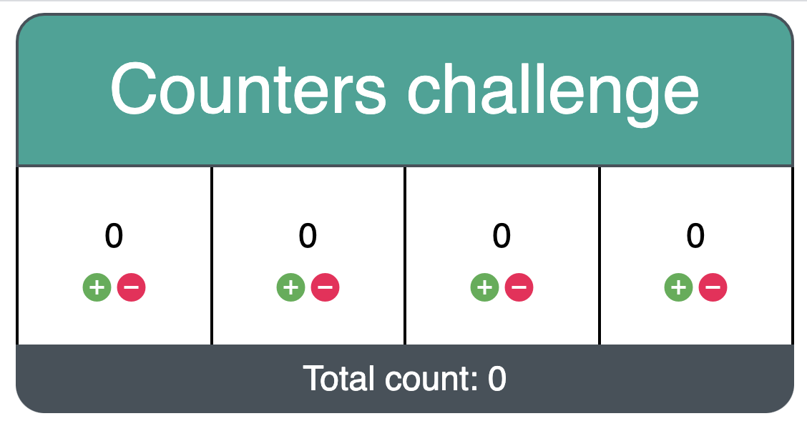

# App Counter

Hi and welcome dear candidate, before anything, we value your time and we don't want you to spend a lot of time working on this. We prepared an small exercise that is divided in stages. Book only a couple of hours of your time and complete all the stages you can. Don't worry if you can't complete everything, this won't be taken in consideration. During the interview we'll discuss, and refactor this kata.

## General instructions
Download the content of this folder and take a look on the code. Solve the stages in a way we can go through the solutions (usually separated commits in a public repository). When you finish the exercise send us back the solution with the link to the repository or with a zipped file via email. We hope you have fun!

## Setup
Run `npm install`, then run `npm start` to start the application and `npm test` to run the tests.

This simple app contains 3 counters and buttons to add and substract numbers every time the buttons are hit, or at least that is what it should be doing. The main goal of this exercise is to provide some basic functionality to this buttons.

## Stage1:
The `+` and `-` currently don't do anything. We'd like to see that everytime
the `+` button is clicked, the associated number displayed should be incremented by `1` and when the `-` button is clicked, the associated number displayed should be decremented by `1`.
## Stage2:
There is new requirement for an extra Counter and ensure it's value is updated independently from the others.

## Stage3:
Users expressed that would be useful to see the total number that represents the sum of all the counters. Add a new element to the application to show this result.

## Stage4:
The application has no style whatsoever. We include an screenshot. Try to add some CSS so it looks as similar as possible.

